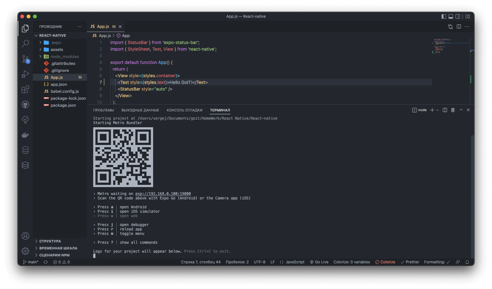
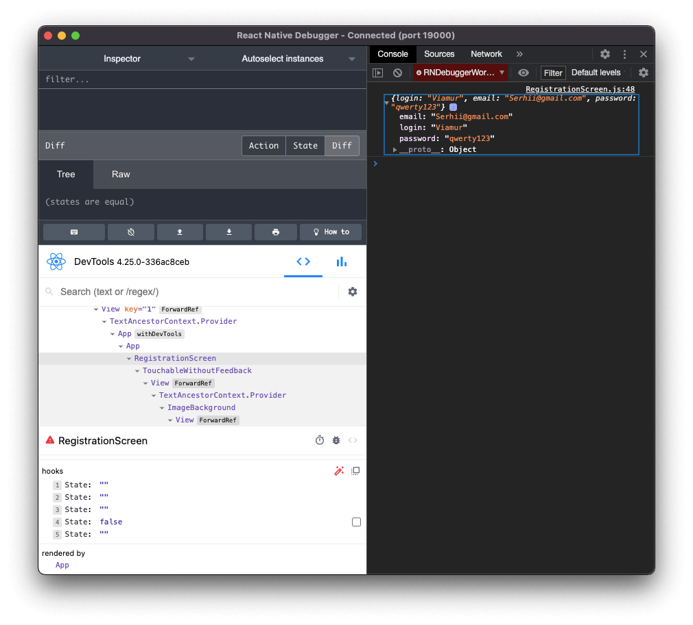

<h1 align="center">React native - my first app</h1>


iOS open this link on your device:
```sh
exp://u.expo.dev/update/d407ec9c-1b31-4e17-933a-1215b66ded6c
```

Android open this link on your device:
```sh
exp://u.expo.dev/update/f6f0c13c-7ee5-487f-b44b-1c4a34065b70
```

Below are screenshots of the application development stages ⬇️ ⬇️ ⬇️

# goit-react native-hw-01



# goit-react native-hw-02


# goit-react native-hw-03



# goit-react native-hw-04


# goit-react native-hw-05


# goit-react native-hw-06


# goit-react native-hw-07


